# Continental Premium Properties 🏠

A fully responsive real estate website built with the MERN stack, supporting 100+ property listings in English, Arabic, and French. Continental Premium Properties provides a clean, modern user interface with dark/light modes, smooth cross-device performance, and direct contact with property owners. The admin dashboard enables secure and efficient management of listings, including adding, editing, deleting, and viewing property details with multiple images.

## Features ✅

- **MERN Stack Architecture** – MongoDB, Express.js, Next.js, Node.js
- **Multilingual Support** – English, Arabic, and French interfaces
- **Admin Dashboard** – Manage listings with secure authentication
- **Dark/Light Mode** – User-friendly, aesthetic, and responsive
- **Property Details** – Multiple images, descriptions, and contact options
- **Direct Owner Contact** – Simplifies the buyer-seller connection
- **Responsive Design** – Optimized for desktop, tablet, and mobile
- **Real-Time Database** – Instant updates for listings

## How It Works ⚙️

1. Users browse properties in English, Arabic, or French.
2. View detailed listings with multiple images.
3. Contact property owners directly.
4. Admins can manage listings securely via the dashboard.

## Technologies Used 🛠️

- **Frontend:** Next.js 16, React 19, Tailwind CSS, next-intl
- **Backend:** Node.js, Express.js
- **Database:** MongoDB
- **Authentication:** JSON Web Tokens (JWT)
- **Hosting:**
  - Frontend: Vercel
  - Backend: Render

## 🎬 Site Demo

**[▶ Watch site walkthrough](./docs/continental-premium-properties-demo.mp4)**

Arabic intro on home → scroll featured projects (Buy / All filters) → projects catalog & listing detail → Media Center → About Us → contact form → admin login → dashboard stats → admin add & edit project forms.

## Screenshots 📸

|                                                                                  |                                                                                   |
| -------------------------------------------------------------------------------- | --------------------------------------------------------------------------------- |
| **Home Hero** 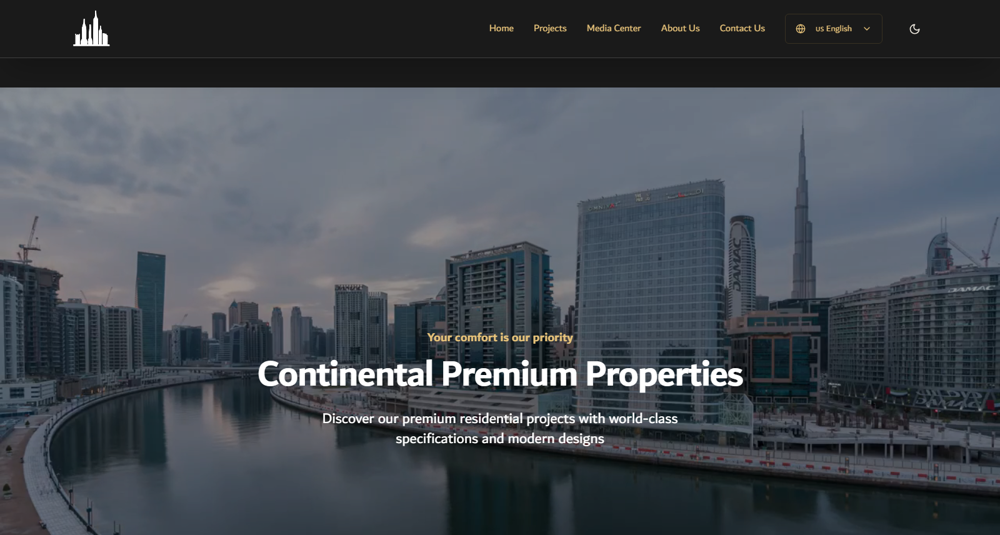                       | **Projects Page** 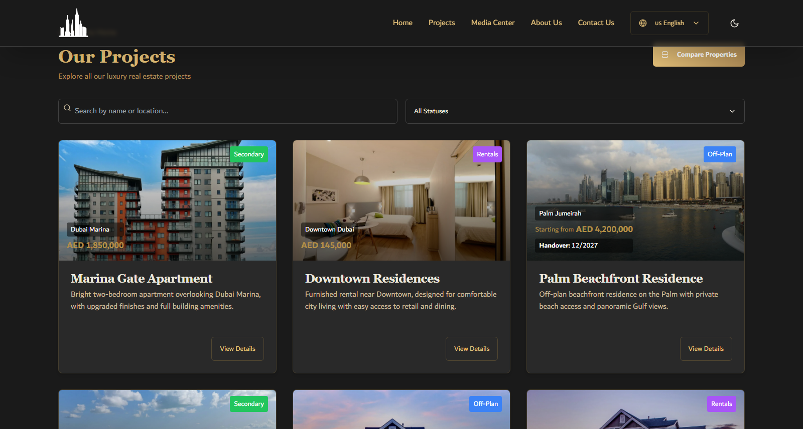       |
| **Property Details** 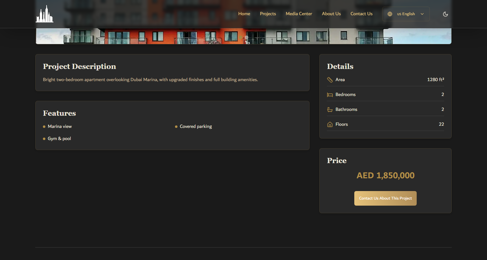 | **Media Center** 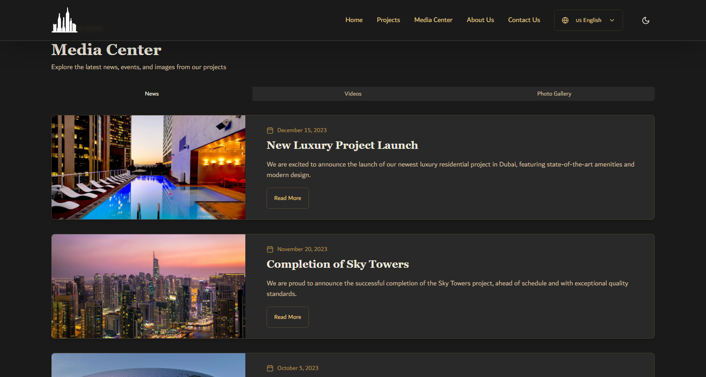          |
| **About Us** 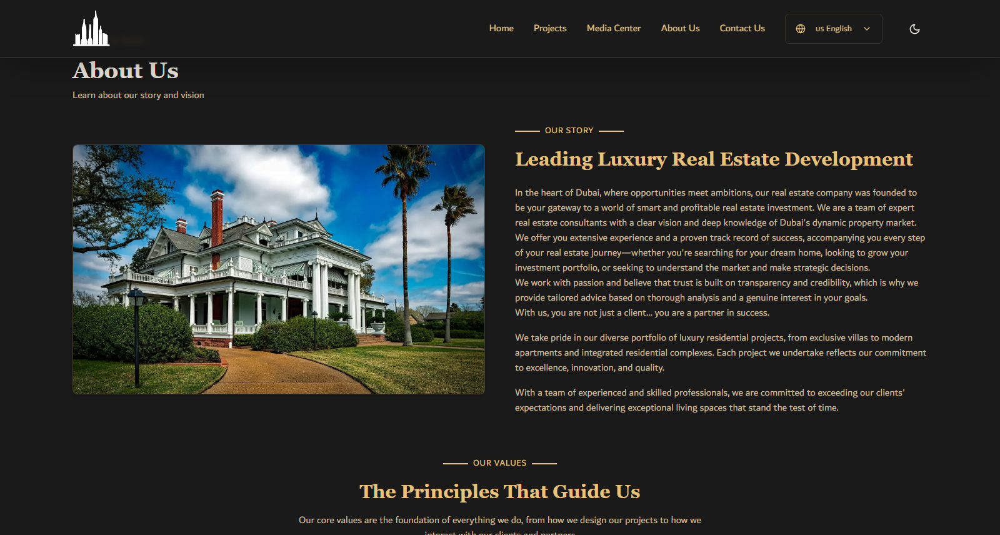                     | **Contact Us** 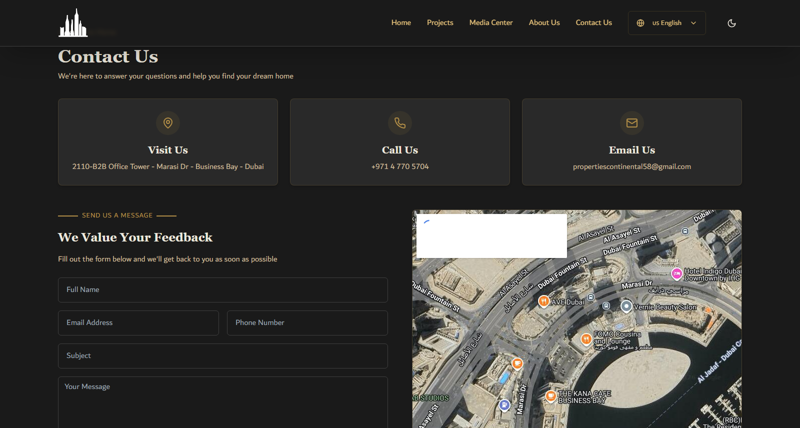                |
| **Admin Login** 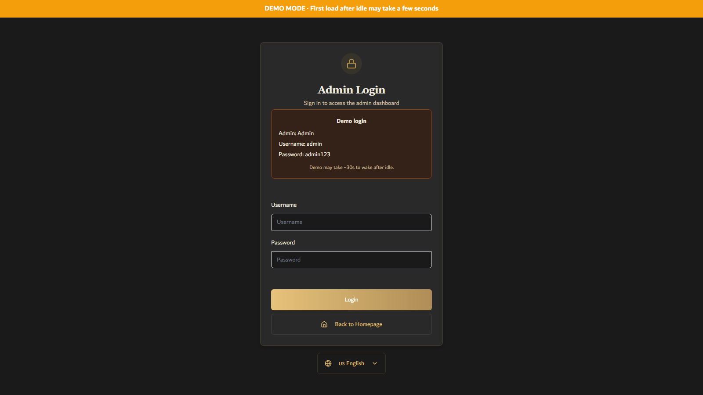            | **Admin Dashboard** 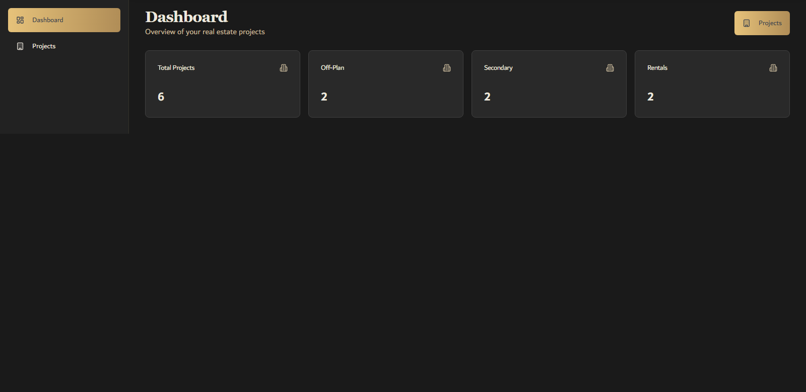 |
| **Admin Projects** 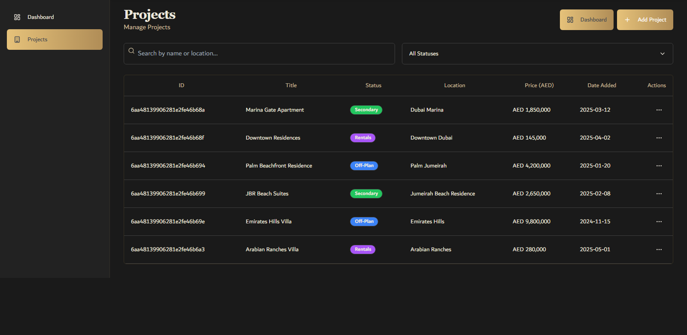   | **Add Project** 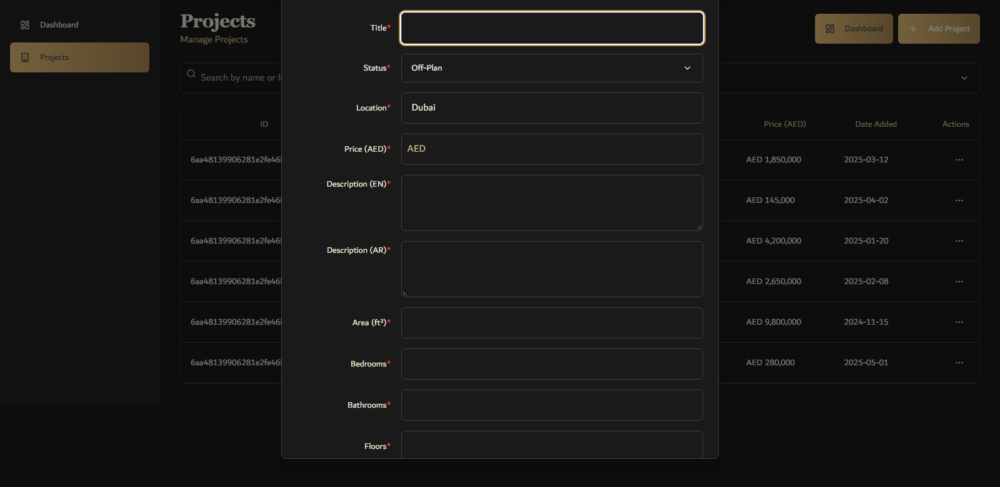             |
| **Mobile Home** 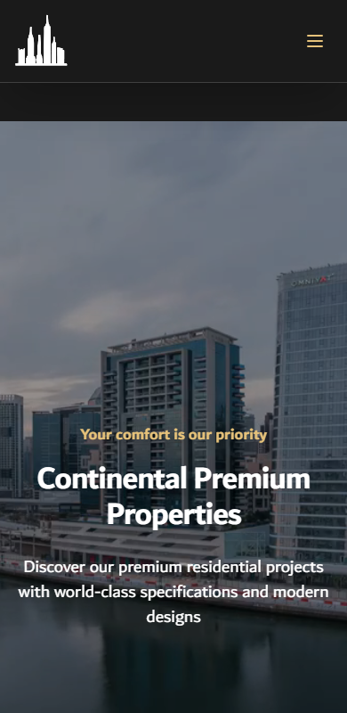            |                                                                                   |

## Live Demo 🚀

**[View Live Demo](https://continental-premium-properties-demo.vercel.app/)**

| Role  | Username | Password   |
| ----- | -------- | ---------- |
| Admin | `admin`  | `admin123` |

## Author

👤 **Omar Mahmoud**
📧 [omrmhd54@gmail.com](mailto:omrmhd54@gmail.com)
💼 [LinkedIn](https://www.linkedin.com/in/omrmhd5/)
🌐 [Portfolio](https://omarmahmoud.dev/)
🔗 [GitHub](https://github.com/omrmhd5)
